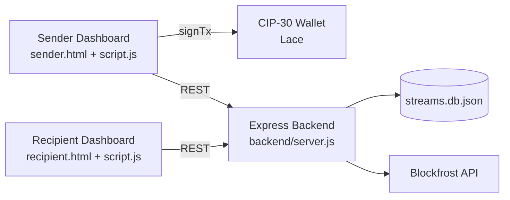
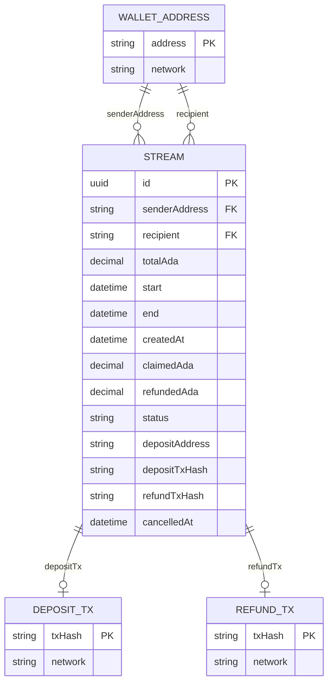
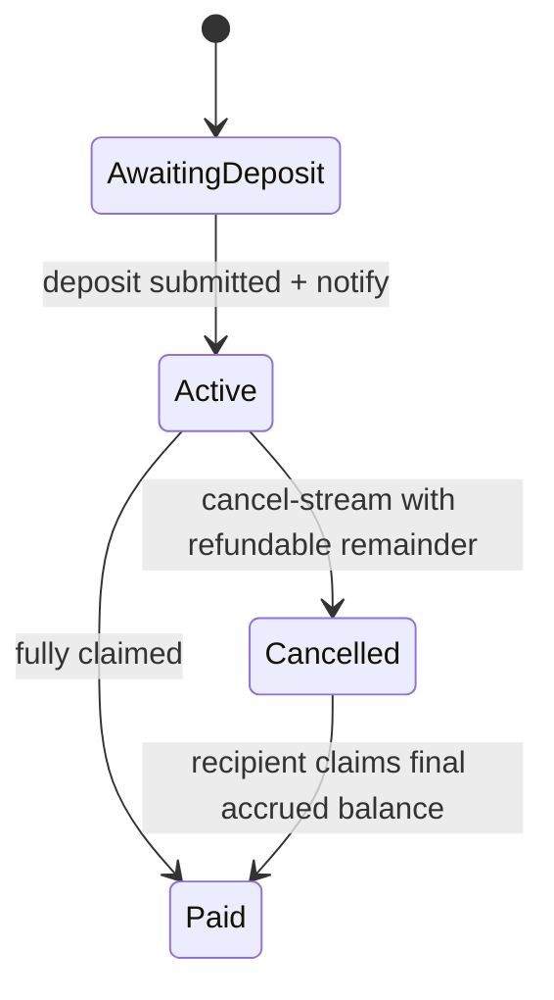

# Coxygen Salary Payroll System

## 1. System Overview
This project is a salary streaming payroll simulation built on Cardano-oriented tooling.

It provides:
- A sender dashboard to create, fund, monitor, and cancel salary streams.
- A recipient dashboard to view accrued salary and claim funds.
- An Express backend that persists streams, builds/submits blockchain transactions, and exposes API endpoints consumed by the frontend.

The current hosted backend target used by the frontend is:
- `https://coxygen-salary-payroll-system.onrender.com`

## 2. Scope and Actors
### 2.1 Actors
- Sender: Creates and funds payment streams.
- Recipient: Claims accrued funds from active/cancelled/paid streams where claimable amount exists.
- Backend Service: Stores stream state, computes accrual/claim/refund outcomes, integrates with Blockfrost and Cardano serialization library.
- Cardano Wallet (CIP-30): Signs deposit transactions from browser context.
- Blockfrost API: Provides protocol parameters, UTXOs, and tx submission endpoints.

### 2.2 Business Goal
Simulate streaming payroll where salary accrues over time and can be claimed progressively, with support for cancellation and proportional refunding.

## 3. High-Level Architecture

## 4. Domain Model (ERD)
This ERD shows the conceptual model. `DEPOSIT_TX` and `REFUND_TX` are external blockchain transaction references (hashes), not persisted as standalone tables in this codebase.

## 5. Physical Persistence Model
The backend persists streams in a file-based key-value store:
- File: `backend/streams.db.json`
- Structure: `{ [streamId: string]: Stream }`

### 5.1 Stream Attributes
- `id`: UUID for stream.
- `senderAddress`: Cardano address of sender.
- `recipient`: Cardano address of recipient.
- `total`: Total ADA committed to stream.
- `start`: ISO timestamp for stream start.
- `end`: ISO timestamp for stream end.
- `createdAt`: ISO timestamp for creation.
- `claimed`: Total ADA claimed so far.
- `refunded`: Total ADA refunded to sender so far.
- `status`: `AwaitingDeposit | Active | Cancelled | Paid`.
- `depositAddress`: Escrow/script address.
- `depositTx`: Deposit transaction hash.
- `refundTx`: Refund transaction hash.
- `cancelledAt`: ISO timestamp when cancelled (nullable).

## 6. Stream Lifecycle and Rules
### 6.1 Status Lifecycle

### 6.2 Core Calculations
- Duration seconds: `max(1, (end - start) / 1000)`
- Rate (ADA/sec): `total / durationSeconds`
- Accrued at time `t`: `min(total, rate * elapsedSeconds)`
- Effective end for accrual: `min(end, cancelledAt)` if cancelled, else `end`
- Claimable: `max(0, accrued - claimed)`
- Refundable on cancel: `max(0, total - accruedAtCancel - refunded)`

Minimum on-chain transfer guard:
- 1 ADA minimum (`1_000_000` lovelace) for payouts/refunds.

## 7. Use Case Documentation
### UC-01 Connect Wallet
- Primary actor: Sender or Recipient
- Preconditions: CIP-30 wallet extension available (Lace expected by default).
- Main flow:
1. User clicks Connect Wallet.
2. Frontend calls wallet provider `enable()`.
3. Wallet address and state are stored in localStorage.
- Success outcome: User session has connected wallet state and address available to stream operations.

### UC-02 Create and Fund Stream
- Primary actor: Sender
- Preconditions: Wallet connected, valid recipient address, valid start/end, total >= 1 ADA.
- Main flow:
1. Sender submits stream form.
2. Frontend calls `POST /create-stream`.
3. Backend creates `AwaitingDeposit` stream and returns `id` + `depositAddress`.
4. Frontend requests `POST /build-deposit`.
5. Wallet signs unsigned tx (`signTx`), frontend calls `POST /submit-signed-deposit`.
6. Frontend calls `POST /notify-deposit`.
7. Stream becomes `Active`.
- Alternate flow: If funding fails, frontend best-effort calls `POST /discard-stream`.

### UC-03 Hydrate Existing Streams
- Primary actor: Sender or Recipient
- Preconditions: Backend reachable.
- Main flow:
1. On bootstrap, frontend requests `GET /streams`.
2. Frontend maps backend stream records into local runtime objects.
3. UI renders sender and recipient views.
- Success outcome: Local UI is synchronized with persisted backend streams.

### UC-04 Claim for a Stream
- Primary actor: Recipient
- Preconditions: Caller wallet address matches stream recipient; stream status in claimable set (`Active`, `Cancelled`, `Paid`); claimable amount > 0.
- Main flow:
1. Frontend computes claimable amount.
2. Frontend calls `POST /claim` with `id`, `recipientAddress`, and snapshot.
3. Backend computes accrued vs claimed and submits escrow payout when eligible.
4. Backend returns claimed amount and tx hash.
5. Frontend updates local state and UI.
- Success outcome: Claimed amount increases; stream may transition to `Paid`.

### UC-05 Claim All
- Primary actor: Recipient
- Preconditions: Connected wallet; at least one eligible stream addressed to wallet.
- Main flow:
1. Frontend filters all streams by recipient address and claimable statuses.
2. Calls UC-04 flow for each eligible stream.
3. Aggregates claimed total and refreshes UI.
- Success outcome: Recipient claims across all eligible streams in one action.

### UC-06 Cancel Stream
- Primary actor: Sender
- Preconditions: Stream is `Active`; sender address valid for configured network.
- Main flow:
1. Frontend calls `POST /cancel-stream`.
2. Backend stamps `cancelledAt` if missing.
3. Backend computes refundable remainder and executes payout to sender when above minimum.
4. Backend sets status to `Cancelled` or `Paid` based on remaining claimability.
- Success outcome: Stream is cancelled with refund tx when applicable.

### UC-07 Export Reports
- Primary actor: Sender
- Preconditions: Backend reachable for PDF export.
- Main flow:
1. CSV export is generated client-side from current in-memory stream list.
2. PDF export calls `GET /report/streams.pdf`.
3. Backend generates an A4 PDF report using PDFKit (no browser runtime dependency).
- Success outcome: Payslip/report artifacts downloaded by user.

## 8. API Documentation
### 8.1 Stream Management
- `POST /create-stream`
  - Creates stream draft with status `AwaitingDeposit`.
- `POST /notify-deposit`
  - Marks stream `Active` and stores `depositTx`.
- `POST /discard-stream`
  - Deletes unfunded `AwaitingDeposit` stream.
- `POST /cancel-stream`
  - Cancels active stream and processes refundable payout.
- `GET /streams`
  - Returns all streams.
- `GET /stream/:id`
  - Returns one stream by id.

### 8.2 Claim and Transaction Flows
- `POST /claim`
  - Claims accrued amount for recipient.
- `POST /build-deposit`
  - Builds unsigned deposit tx (or returns plan fallback).
- `POST /build-claim`
  - Builds unsigned claim tx (or returns plan fallback).
- `POST /submit-signed-deposit`
  - Merges witness set into unsigned tx and submits.

### 8.3 Reporting
- `GET /report/streams.pdf`
  - Generates PDF report of current streams.

## 9. Technologies Used
### 9.1 Frontend
- HTML5 pages: `index.html`, `sender.html`, `recipient.html`
- CSS: `styles.css`
- JavaScript: `script.js` (vanilla JS, no framework)
- UI library: Bootstrap 5.3 (CDN)
- Browser persistence: `localStorage`
- Wallet integration: CIP-30 API via `js/walletManager.js`

### 9.2 Backend
- Runtime: Node.js
- Framework: Express 4
- Middleware: `body-parser`, `cors`
- HTTP client: `node-fetch`
- Env management: `dotenv`
- ID generation: `uuid`
- PDF generation: `pdfkit`
- Persistence: JSON file (`backend/streams.db.json`)

### 9.3 Cardano and Blockchain Integration
- `@emurgo/cardano-serialization-lib-nodejs` for tx assembly/witness handling
- `@blockfrost/blockfrost-js` and Blockfrost REST endpoints for protocol parameters, UTXOs, and tx submission
- Network awareness via address prefix checks (`addr1` mainnet, `addr_test1` preprod)

### 9.4 Hosting and Deployment
- Backend hosted on Render (as configured in frontend `BACKEND_URL`)
- Static frontend assets served by Express (`express.static`) in current setup

## 10. Security and Operational Notes
- This is a demo/simulation-oriented implementation and not production hardened.
- Escrow signing key handling is environment-driven and requires secure key management before production.
- Add production controls before real deployment:
  - Authentication and authorization
  - Rate limiting and abuse protection
  - Structured audit logging and alerting
  - Strong secret management for signing keys
  - Automated tests and monitoring

## 11. Repository Structure
- `script.js`: frontend business logic and API integration
- `js/walletManager.js`: wallet connection/session management
- `backend/server.js`: API, persistence, payout/refund logic, report generation
- `backend/txBuilder.js`: transaction builder helpers
- `backend/streams.db.json`: persisted stream records
- `sender.html` and `recipient.html`: role-specific dashboards
